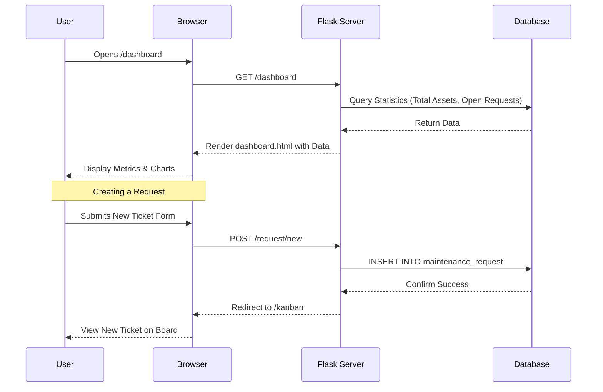
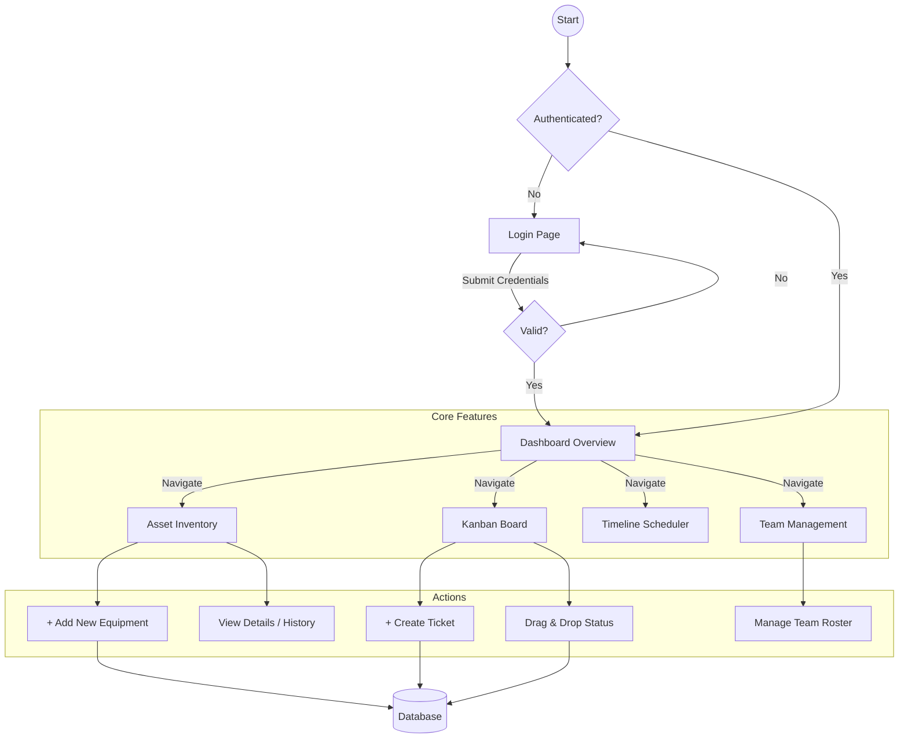

# GearGuard: The Ultimate Maintenance Tracker

This document provides a comprehensive overview of the GearGuard project, including how to run it, the architectural flow, and how the different components work together.

## 🚀 Project Overview

**GearGuard** is a robust Maintenance Management System (CMMS) designed to track equipment, schedule maintenance (Preventive & Corrective), manage specialized teams, and visualize operations via a real-time dashboard.

### 🛠 Technology Stack
*   **Backend**: Python (Flask)
*   **Database**: SQLite (SQLAlchemy ORM)
*   **Frontend**: HTML5, Jinja2 Templates, TailwindCSS (via CDN)
*   **Icons**: FontAwesome 6
*   **Charts**: Chart.js
*   **Calendar**: FullCalendar.js
*   **Drag & Drop**: Sortable.js (Kanban Board)

---

## 📋 How to Run the Project

1.  **Prerequisites**: Ensure Python is installed.
2.  **Install Dependencies** (if a `requirements.txt` exists, otherwise install the basics):
    ```bash
    pip install flask flask-sqlalchemy flask-login flask-bcrypt
    ```
3.  **Start the Application**:
    ```bash
    python app.py
    ```
    *   *Note: On first run, the system automatically creates the database `maintenance.db` and seeds it with initial demo data.*
4.  **Access the App**:
    *   Open your browser and navigate to: `http://127.0.0.1:5000`
    *   **Default Login**:
        *   **Email**: `admin@gearguard.com`
        *   **Password**: `admin123`

---

## 🔄 Application Flow & Architecture

### 1. High-Level System Architecture

```mermaid
graph TD
    User[User / Operator] -->|HTTP Request| Flask[Flask Backend (app.py)]
    Flask -->|Query/Update| DB[(SQLite Database)]
    Flask -->|Render| Templates[Jinja2 HTML Templates]
    Templates -->|Load| CSS[TailwindCSS]
    Templates -->|Load| JS[Chart.js / FullCalendar]
    
    subgraph Frontend Components
    Templates -- Includes --> Base[base.html (Layout & Theme)]
    Base -- Extends --> Dashboard[Dashboard]
    Base -- Extends --> Kanban[Kanban Board]
    Base -- Extends --> Equipment[Asset Inventory]
    end
```

### 2. User Journey Information Flow

This diagram illustrates how data flows from the user's action to the database and back.



---

## 📂 Project Structure

*   **`app.py`**: The heart of the application. Contains:
    *   **Configuration**: Database and Secret Key settings.
    *   **Models**: Defines the data structure (`User`, `Equipment`, `MaintenanceRequest`, `Team`, `Category`, `Notification`).
    *   **Routes**: Handles URL requests (e.g., `/`, `/login`, `/api/events`).
    *   **Logic**: Authentication, filtering, and data processing.
*   **`templates/`**: Contains the frontend HTML files.
    *   `base.html`: The master layout. Handles the **Sidebar**, **Header**, **Theme Switching** (Light/Dark), and **Notifications**.
    *   `dashboard.html`: Main overview with Chart.js visualization.
    *   `kanban.html`: Drag-and-drop board for managing ticket status.
    *   `calendar.html`: Interactive timeline of scheduled maintenance.
    *   `equipment_*.html`: Pages for listing and adding assets.
    *   `login.html` / `signup.html`: Authentication pages.

---

## 🎨 Theme System (Light / Dark Mode)

The project uses a sophisticated CSS Variable system for theming, located in `base.html`.

*   **Logic**:
    *   The `<body>` class defaults to the dark theme variables.
    *   Toggling the button checks `localStorage` and adds/removes the `.light-mode` class on the `<html>` element.
    *   **Variables**:
        *   `--bg-pure`: Main background (Black/White).
        *   `--text-primary`: Main text color (White/Black).
        *   `--logo-bg` / `--logo-text`: Specifically for high-contrast branding.

---

## 🛠 Key Features Explanation

1.  **Kanban Board**:
    *   Uses **Sortable.js** to allow dragging cards between 'New', 'In Progress', 'Pending', and 'Completed'.
    *   When a card is dropped, an AJAX `fetch` request is sent to `/api/request/<id>/status` to update the database instantly without refreshing.

2.  **Real-Time Calendar**:
    *   Uses **FullCalendar.js**.
    *   Polls the `/api/events` endpoint every 10 seconds.
    *   **Color Coding**:
        *   <span style="color: #ef4444">■</span> **Red**: Corrective Maintenance (Breakdowns)
        *   <span style="color: #0ea5e9">■</span> **Blue**: Preventive Maintenance (Routine)

3.  **Automated Notifications**:
    *   When a new request is created, a `Notification` record is generated for the `admin`.
    *   The bell icon in the header polls `/api/notifications` to show alerts in real-time.

---

## 🗺️ User Workflow Diagram

This flowchart represents the navigational structure and user actions within the application.


